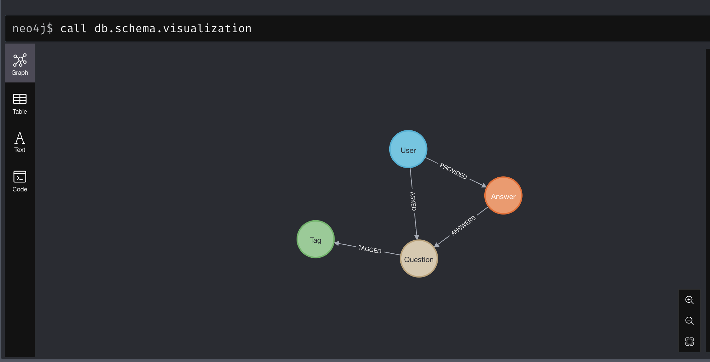

# TP Neo4j

### Lundi

#### Activité 3

WITH "file:///nvdcve-1.1-2021.json" as url 
CALL apoc.load.json(url) YIELD value 
UNWIND keys(value) AS key
RETURN key, apoc.meta.cypher.type(value[key]);

CALL apoc.periodic.iterate("CALL apoc.load.json('file:///nvdcve-1.1-2021.json') YIELD value",
"UNWIND  value.CVE_Items AS data  \r\n"+
"UNWIND data.cve.references.reference_data AS references \r\n"+
"MERGE (cveItem:CVE {uid: apoc.create.uuid()}) \r\n"+
"ON CREATE SET cveItem.cveid = data.cve.CVE_data_meta.ID, cveItem.references = references.url",
 {batchSize:2000, iterateList:true});

#### Activité 4

CALL apoc.load.json('file:///data.json') YIELD value
UNWIND value.items as item

MERGE (question:Question {
    id: item.question_id,
    title: item.title,
    score: item.score,
    view_count: item.view_count,
    creation_date: datetime({epochSeconds: item.creation_date})
})

WITH item, question
UNWIND item.tags as tagName
MERGE (tag:Tag {name: tagName})
CREATE (question)-[:TAGGED]->(tag)

WITH item, question
MERGE (author:User {
    id: item.owner.user_id,
    display_name: item.owner.display_name,
    reputation: item.owner.reputation
})
CREATE (author)-[:ASKED]->(question)

WITH item, question
UNWIND item.answers as answerData
MERGE (answer:Answer {
    id: answerData.answer_id,
    score: answerData.score,
    is_accepted: answerData.is_accepted,
    creation_date: datetime({epochSeconds: answerData.creation_date})
})
CREATE (answer)-[:ANSWERS]->(question)

MERGE (answerer:User {
    id: answerData.owner.user_id,
    display_name: answerData.owner.display_name,
    reputation: answerData.owner.reputation
})
CREATE (answerer)-[:PROVIDED]->(answer);

### Mardi
