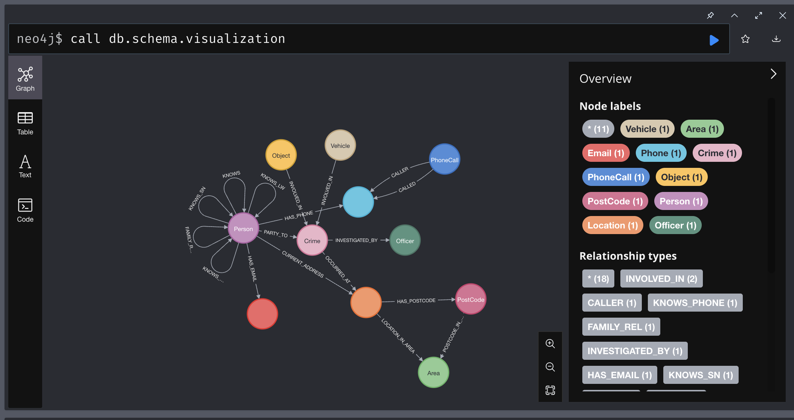
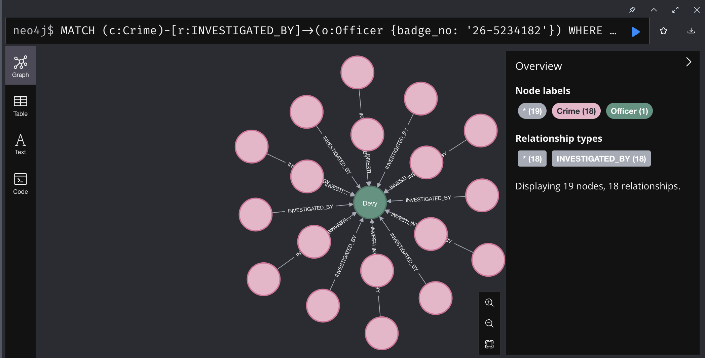
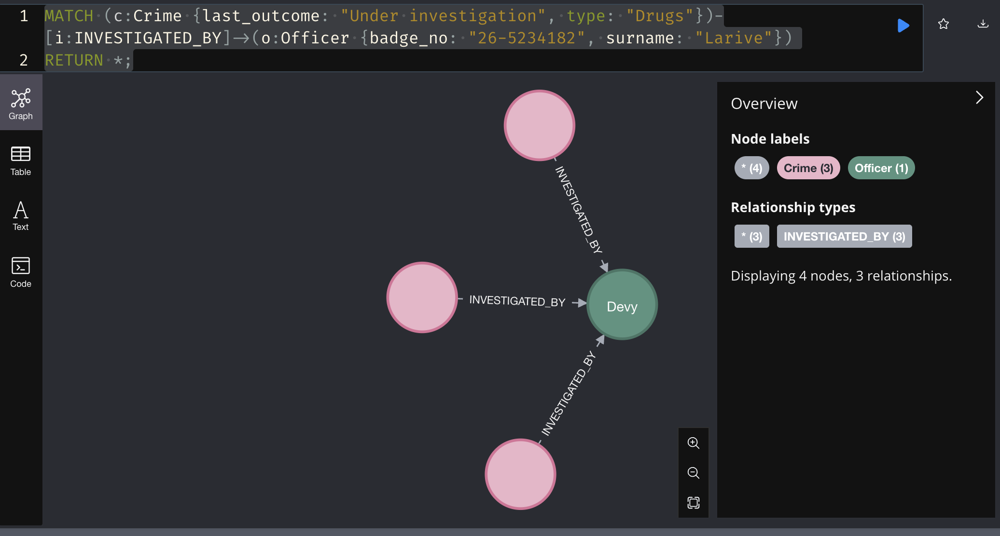
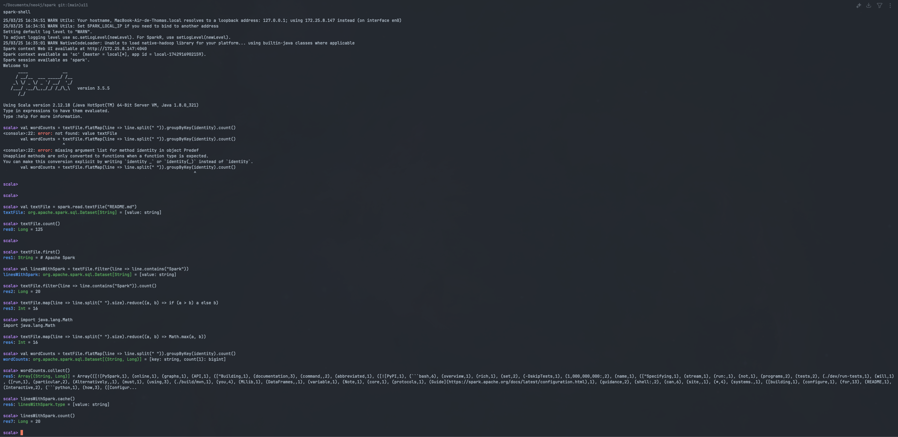
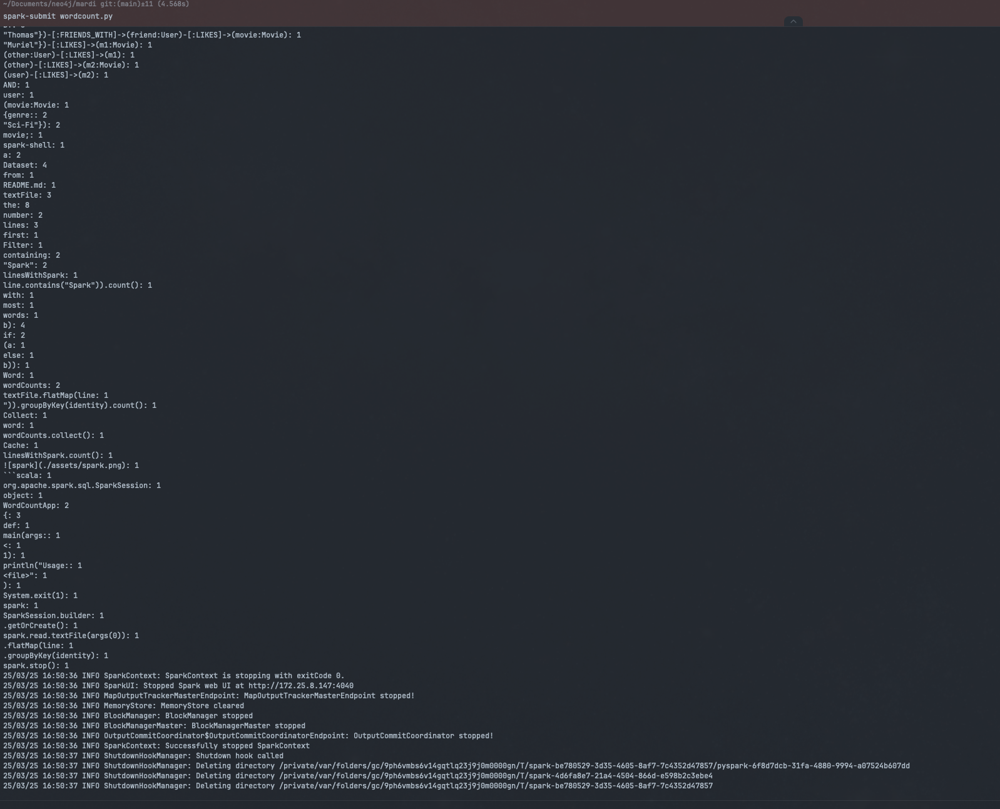
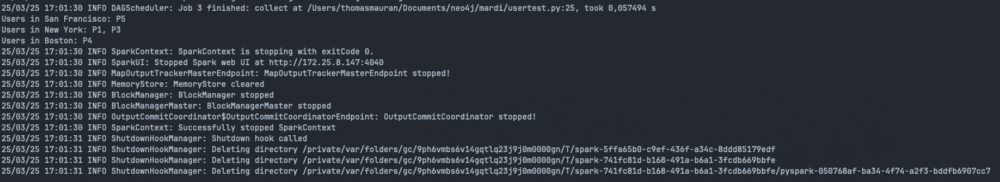

## 

### Crime 

```cypher
call db.schema.visualization
```




```cypher
MATCH (c:Crime)-[r:INVESTIGATED_BY]->(o:Officer {badge_no: '26-5234182'})
WHERE NOT c.last_outcome STARTS WITH "Investigation complete"
RETURN c, r, o
```


```cypher
MATCH (c:Crime {last_outcome: "Under investigation", type: "Drugs"})-[i:INVESTIGATED_BY]->(o:Officer {badge_no: "26-5234182", surname: "Larive"})
RETURN *;
```




### Movies


```cypher
CREATE (u:User {name: "Matéo" });
CREATE (u:User {name: "Adrien" });
CREATE (u:User {name: "Noé" });
CREATE (u:User {name: "Muriel" });
CREATE (u:User {name: "Thomas" });
CREATE (u:User {name: "Vincent" });
CREATE (u:User {name: "Martin" });
CREATE (u:User {name: "Dziyana" });
CREATE (u:User {name: "Charley" });
CREATE (u:User {name: "Rémi" });
CREATE (u:User {name: "Fabien" });
CREATE (u:User {name: "Alexandre" });
CREATE (u:User {name: "Sylvain" });
CREATE (u:User {name: "Mathias" });


CREATE (m:Movie {title: "The Matrix", genre: "Action"});
CREATE (m:Movie {title: "Inception", genre: "Sci-Fi" });
CREATE (m:Movie {title: "The Godfather", genre: "Drama" });
CREATE (m:Movie {title: "Forest Gump", genre: "Drama"});
CREATE (m:Movie {title: "Intersaellar", genre: "Sci-FI" });
CREATE (m:Movie {title: "Mission Impossible", genre: "Action" });
CREATE (m:Movie {title: "La La Land", genre: "Musical" });
CREATE (m:Movie {title: "Fight club", genre: "Action" });
CREATE (m:Movie {title: "Oppenheimer", genre: "Thriller" });
CREATE (m:Movie {title: "The Dark Knight", genre: "Action" });
CREATE (m:Movie {title: "The Social Network", genre: "Biography" });

MATCH (u:User {name: "Thomas" }), (m:Movie {title: "Intersaellar", genre: "Sci-FI" })
MERGE (u)-[:LIKES]->(m);
```

```cypher
CREATE
    (mateo:User {name: "Matéo" }),
    (adrien:User {name: "Adrien" }),
    (noe:User {name: "Noé" }),
    (muriel:User {name: "Muriel" }),
    (thomas:User {name: "Thomas" }),
    (vincent:User {name: "Vincent" }),
    (martin:User {name: "Martin" }),
    (dziyana:User {name: "Dziyana" }),
    (charley:User {name: "Charley" }),
    (remi:User {name: "Rémi" }),
    (fabien:User {name: "Fabien" }),
    (alexandre:User {name: "Alexandre" }),
    (sylvain:User {name: "Sylvain" }),
    (mathias:User {name: "Mathias" }),
    (m0:Movie {title: "The Matrix", genre: "Action"}),
    (m1:Movie {title: "Inception", genre: "Sci-Fi" }),
    (m2:Movie {title: "The Godfather", genre: "Drama" }),
    (m3:Movie {title: "Forest Gump", genre: "Drama"}),
    (m4:Movie {title: "Interstellar", genre: "Sci-Fi" }),
    (m5:Movie {title: "Mission Impossible", genre: "Action" }),
    (m6:Movie {title: "La La Land", genre: "Musical" }),
    (mateo)-[:LIKES]->(m0),
    (alexandre)-[:LIKES]->(m2),
    (remi)-[:LIKES]->(m4),
    (thomas)-[:LIKES]->(m4),
    (noe)-[:LIKES]->(m5),
    (muriel)-[:LIKES]->(m1),
    (mathias)-[:LIKES]->(m1),
    (sylvain)-[:LIKES]->(m0),
    (fabien)-[:LIKES]->(m5),
    (vincent)-[:LIKES]->(m4),
    (martin)-[:LIKES]->(m0),
    (adrien)-[:LIKES]->(m4),
    (charley)-[:LIKES]->(m4),
    (dziyana)-[:LIKES]->(m0);
```

```cypher
MATCH (user:User {name: "Muriel"})-[:FRIENDS_WITH]->(friend:User)-[:LIKES]->(movie:Movie)
WHERE NOT (user)-[:LIKES]->(movie)
RETURN movie.title, COUNT(*) as score
ORDER BY score DESC


MATCH (user:User {name: "Thomas"})-[:FRIENDS_WITH]->(friend:User)-[:LIKES]->(movie:Movie)
WHERE NOT (user)-[:LIKES]->(movie)
RETURN movie.title, COUNT(*) as score
ORDER BY score DESC

MATCH (user:User {name: "Muriel"})-[:LIKES]->(m1:Movie)
MATCH (other:User)-[:LIKES]->(m1)
MATCH (other)-[:LIKES]->(m2:Movie)
WHERE NOT (user)-[:LIKES]->(m2)
AND user <> other
RETURN m2.title, COUNT(*) as score
ORDER BY score DESC

MATCH (movie:Movie {genre: "Sci-Fi"})
MATCH (vincent:User {name: "Vincent"})-[:LIKES]->(liked:Movie {genre: "Sci-Fi"})
WHERE liked <> movie
RETURN movie;
```

### SPARK

#### Start Spark Shell
spark-shell

#### Create a Dataset from README.md
val textFile = spark.read.textFile("README.md")

#### Count the number of lines in the Dataset
textFile.count()

#### Get the first line in the Dataset
textFile.first()

#### Filter lines containing "Spark"
val linesWithSpark = textFile.filter(line => line.contains("Spark"))

#### Count the number of lines containing "Spark"
textFile.filter(line => line.contains("Spark")).count()

#### Find the line with the most words
textFile.map(line => line.split(" ").size).reduce((a, b) => if (a > b) a else b)

#### Alternative using Math.max
import java.lang.Math
textFile.map(line => line.split(" ").size).reduce((a, b) => Math.max(a, b))

#### Word count using MapReduce
val wordCounts = textFile.flatMap(line => line.split(" ")).groupByKey(identity).count()

#### Collect word counts
wordCounts.collect()

#### Cache the filtered Dataset
linesWithSpark.cache()
linesWithSpark.count()



I made the [wordcount](./wordcount.py) file to do a python word count using spark.

```bash
spark-submit wordcount.py
```



### Test user program

I made the [user_test](./usertest.py) file to test the user program.

in the data/ we have a csv file with the following content:

```bash
spark-submit usertest.py
```

